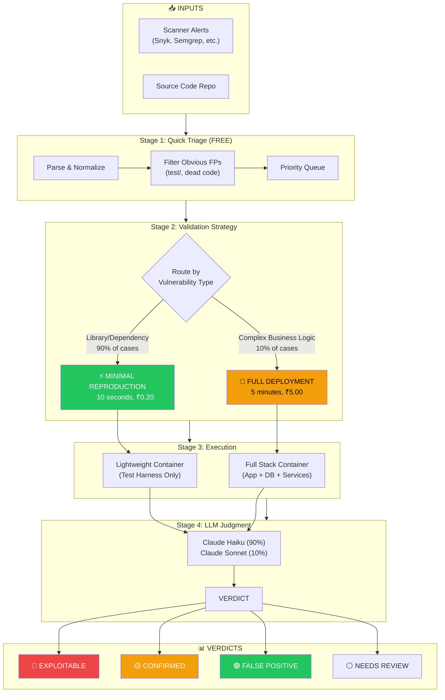
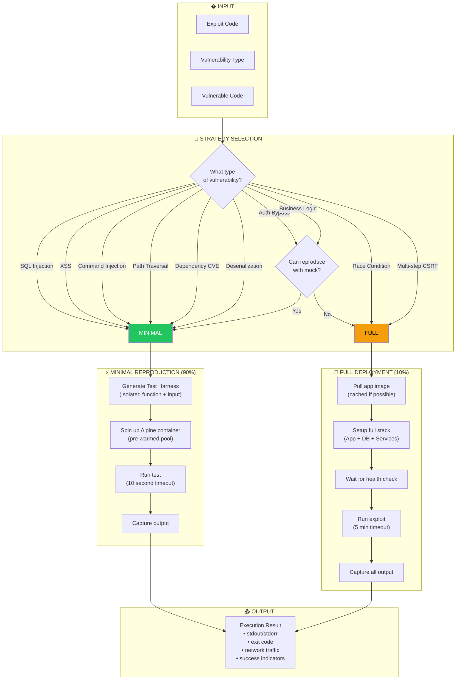
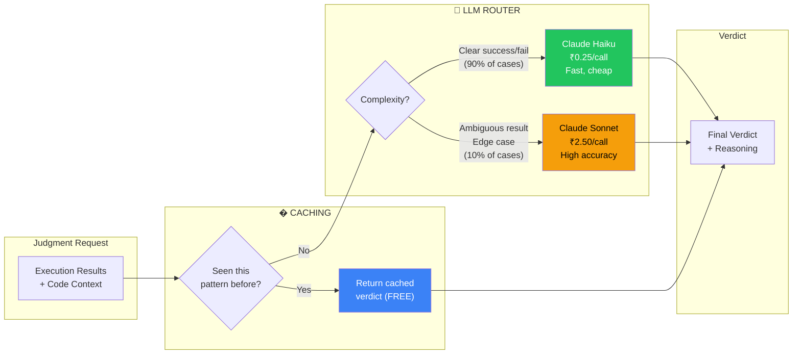
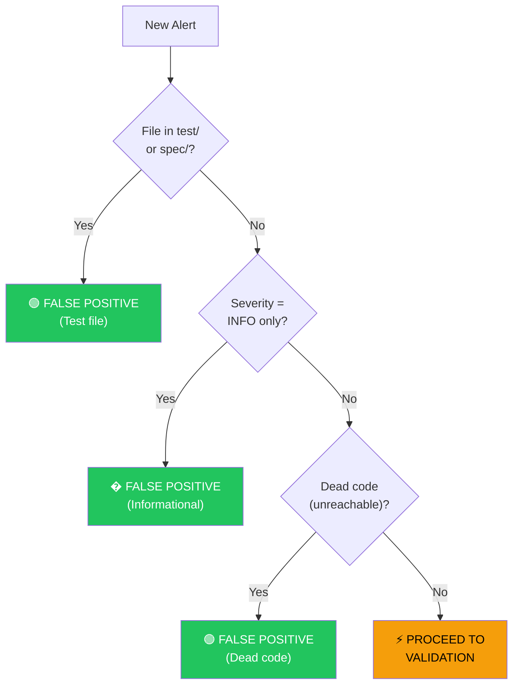
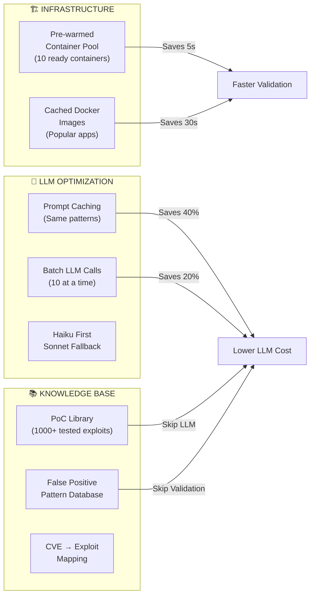
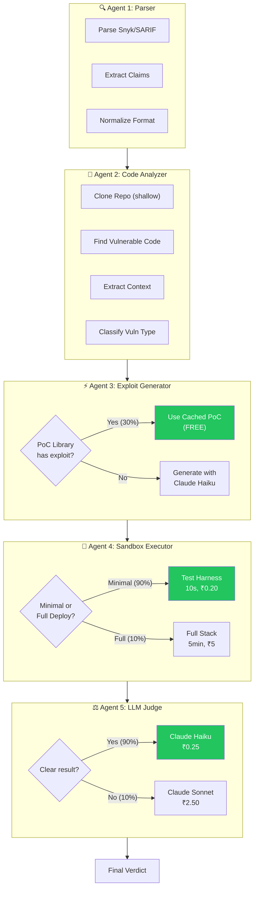

# PoC Validator V2 - Production-Ready Architecture

> **Mission**: Validate 10,000 scanner alerts for ₹3,000 (not ₹100,000)

---

## Performance Targets

| Metric | V0 | MVP | Production |
|--------|-----|-----|------------|
| **Cost per validation** | ₹1-2 | ₹0.50 | ₹0.20 |
| **Time per validation** | 30s | 15s | 10s |
| **Throughput** | 100/hr | 1,000/hr | 10,000/hr |
| **Accuracy (F1)** | 80% | 90% | 95% |

---

## High-Level Flow (Updated)



---

## Agent 4: Sandbox Executor (FIXED)



---

## Minimal Reproduction Examples

### Example 1: SQL Injection

```python
# INSTEAD OF: Deploy full app + database + run query

# MINIMAL REPRODUCTION:
def test_sqli_vulnerability():
    """Test if the vulnerable pattern is exploitable."""
    
    # 1. Extract the vulnerable code pattern
    vulnerable_code = """
    def get_user(user_id):
        query = f"SELECT * FROM users WHERE id = {user_id}"
        return db.execute(query)
    """
    
    # 2. Create test harness with mock database
    harness = f"""
import sqlite3

# Mock the vulnerable function
{vulnerable_code}

# Test with malicious input
test_input = "1 OR 1=1"
try:
    result = get_user(test_input)
    if "SELECT" in str(result) or len(result) > 1:
        print("SUCCESS: SQL Injection confirmed")
        exit(0)
except Exception as e:
    if "syntax" not in str(e).lower():
        print("SUCCESS: Injection possible")
        exit(0)

print("FAILED: Input sanitized")
exit(1)
"""
    
    # 3. Run in 10 seconds
    return run_in_container(harness, timeout=10)
```

### Example 2: Command Injection

```python
# MINIMAL REPRODUCTION:
def test_cmdi_vulnerability():
    """Test command injection without full app."""
    
    harness = """
import subprocess

# Vulnerable pattern from code
def process_file(filename):
    cmd = f"cat {filename}"
    return subprocess.check_output(cmd, shell=True)

# Test with payload
try:
    result = process_file("; id")
    if "uid=" in result.decode():
        print("SUCCESS: Command injection confirmed")
        exit(0)
except:
    pass

print("FAILED: Input sanitized")
exit(1)
"""
    return run_in_container(harness, timeout=10)
```

### Example 3: Dependency CVE (log4j)

```python
# MINIMAL REPRODUCTION:
def test_log4j_vulnerability():
    """Test log4j without deploying full app."""
    
    harness = """
# Check if vulnerable log4j version exists
import subprocess
result = subprocess.run(
    ["grep", "-r", "log4j-core.*2\\.([0-9]|1[0-6])\\.", "pom.xml"],
    capture_output=True
)

if result.returncode == 0:
    print("SUCCESS: Vulnerable log4j version found")
    print(result.stdout.decode())
    exit(0)
else:
    print("FAILED: Safe log4j version")
    exit(1)
"""
    return run_in_container(harness, timeout=10)
```

---

## LLM Strategy (FIXED)



---

## Quick Triage (SOFTENED)



**REMOVED from V0:**
- ❌ ORM assumption (ORMs have CVEs too)
- ❌ Framework assumption (frameworks have CVEs too)
- ❌ Dependency separation (they're easiest to validate!)

**Let data show us what's false positive, don't assume.**

---

## Cost Model (Per 10,000 Validations)

```
┌─────────────────────────────────────────────────────────────────────┐
│                    COST BREAKDOWN                                    │
├─────────────────────────────────────────────────────────────────────┤
│                                                                     │
│  STAGE 1: Quick Triage (FREE)                                       │
│  ├── Parse & normalize............ ₹0 × 10,000 = ₹0                │
│  ├── Filter obvious FPs........... ₹0                               │
│  └── Filtered out: ~3,000 alerts                                    │
│                                                                     │
│  STAGE 2-3: Validation (7,000 alerts proceed)                       │
│  ├── Minimal reproduction (90%)                                     │
│  │   └── 6,300 × ₹0.20 = ₹1,260                                    │
│  ├── Full deployment (10%)                                          │
│  │   └── 700 × ₹5.00 = ₹3,500                                      │
│  └── Subtotal: ₹4,760                                               │
│                                                                     │
│  STAGE 4: LLM Judgment (7,000 alerts)                               │
│  ├── Claude Haiku (90%)                                             │
│  │   └── 6,300 × ₹0.25 = ₹1,575                                    │
│  ├── Claude Sonnet (10%)                                            │
│  │   └── 700 × ₹2.50 = ₹1,750                                      │
│  └── Subtotal: ₹3,325                                               │
│                                                                     │
│  ══════════════════════════════════════════════════════════════     │
│  TOTAL: ₹8,085                                                      │
│                                                                     │
│  WITH OPTIMIZATIONS:                                                │
│  ├── LLM prompt caching (-40%).... -₹1,330                         │
│  ├── Pre-warmed containers (-20%). -₹952                           │
│  ├── PoC library hits (30%)....... -₹1,428                         │
│  └── OPTIMIZED TOTAL: ₹4,375                                       │
│                                                                     │
│  PRICING: ₹50,000/year → 91% GROSS MARGIN ✅                        │
│                                                                     │
└─────────────────────────────────────────────────────────────────────┘
```

---

## Cost Optimization Strategies



---

## Technology Stack (UPDATED)

| Component | Technology | Why |
|-----------|------------|-----|
| **Backend** | FastAPI (Python) | Async, fast, OpenAPI |
| **Frontend** | Next.js 14 | Modern React, SSR |
| **Database** | PostgreSQL | Reliable, JSON support |
| **Queue** | Redis + Celery | Batch job processing |
| **Sandbox** | Docker + Pool | Isolation, pre-warmed |
| **LLM** | **Anthropic Claude** | Consistent, prompt caching |
| **Cache** | Redis | LLM responses, PoCs |
| **Container Pool** | Custom Manager | Pre-warmed containers |

---

## Updated Agent Pipeline



---

## File Structure (Updated)

```
poc_validator/
├── backend/
│   ├── agents/
│   │   ├── report_parser.py       # Parse scanner formats
│   │   ├── code_analyzer.py       # Analyze source code
│   │   ├── exploit_generator.py   # Generate/retrieve exploits
│   │   ├── sandbox_executor.py    # Run in sandbox (UPDATED)
│   │   └── llm_judge.py           # Judge with Claude (UPDATED)
│   │
│   ├── services/
│   │   ├── parsers/
│   │   │   ├── snyk_parser.py     # Snyk JSON
│   │   │   └── sarif_parser.py    # SARIF format
│   │   ├── anthropic_client.py    # Claude API (NEW)
│   │   ├── container_pool.py      # Pre-warmed containers (NEW)
│   │   ├── poc_library.py         # Cached exploits (NEW)
│   │   ├── quick_triage.py        # Fast filtering
│   │   └── github_service.py      # Clone repos
│   │
│   ├── exploits/
│   │   ├── sqli/                  # SQL injection PoCs
│   │   ├── xss/                   # XSS PoCs
│   │   ├── rce/                   # RCE PoCs
│   │   └── dependency/            # CVE-specific PoCs
│   │
│   └── main.py
│
├── frontend/
│   └── app/
│       ├── page.tsx               # Dashboard
│       ├── validate/page.tsx      # Upload & validate
│       └── results/page.tsx       # View results
│
└── docs/
    └── ARCHITECTURE.md            # This file
```

---

## Implementation Priority

| Priority | Task | Impact |
|----------|------|--------|
| **P0** | Minimal reproduction in Agent 4 | **25x cost reduction** |
| **P0** | Switch to Anthropic Claude | Consistent results |
| **P0** | Snyk/SARIF parsers | Real customer input |
| **P1** | Pre-warmed container pool | 5s faster per validation |
| **P1** | PoC library (top 100 CVEs) | 30% skip LLM generation |
| **P1** | LLM prompt caching | 40% LLM cost reduction |
| **P2** | Batch processing API | Handle 10K alerts |
| **P2** | Dashboard UI | Customer-facing |
