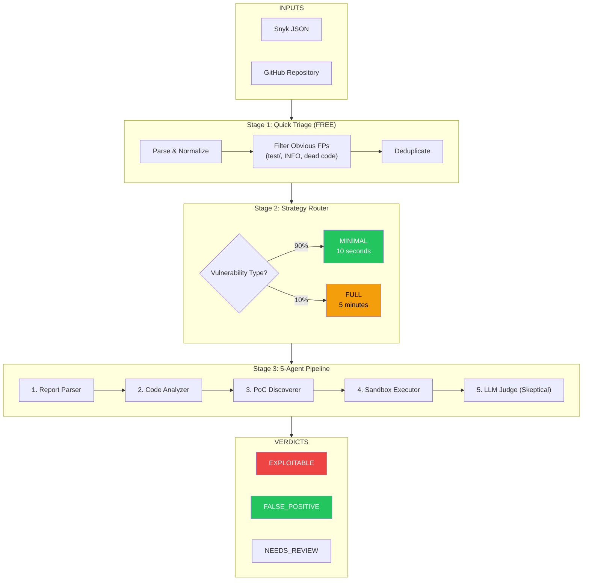
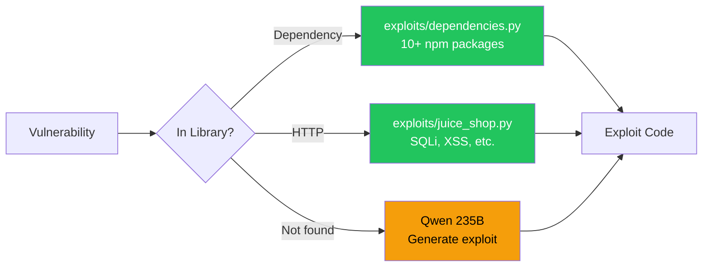
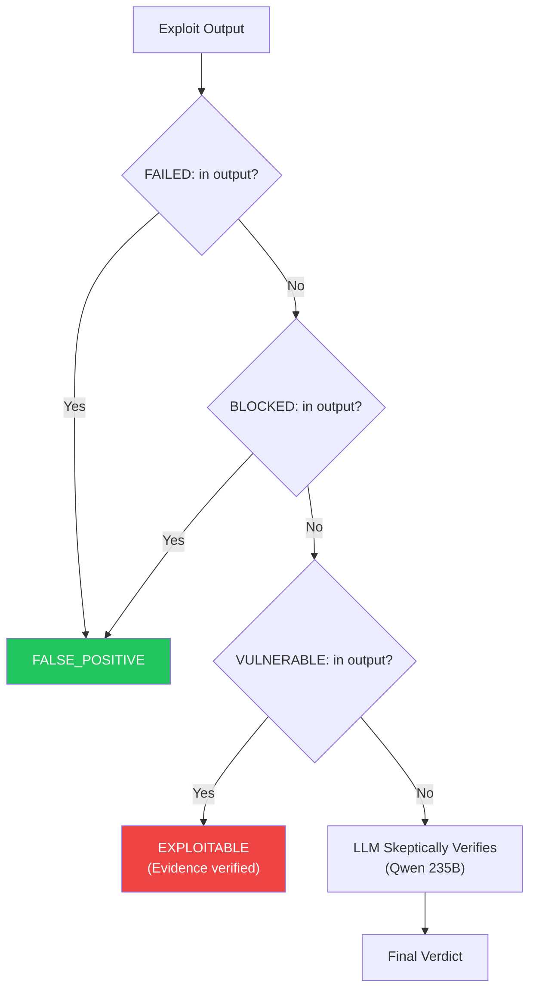
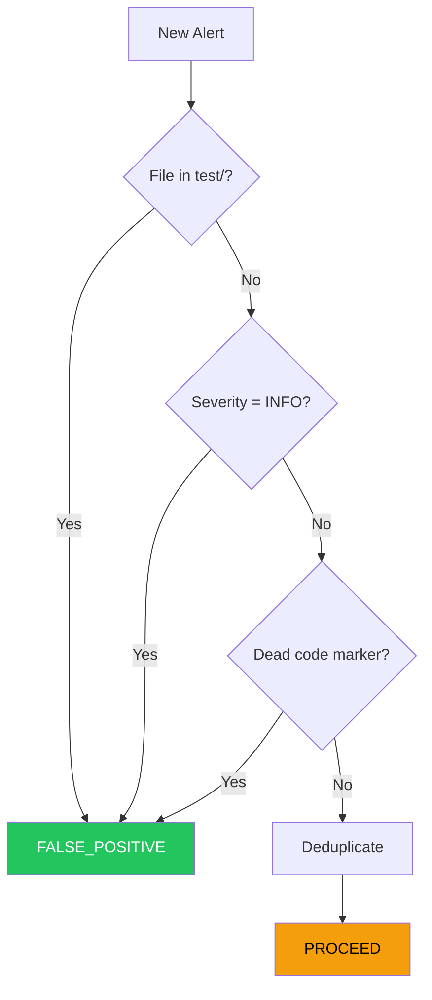

# PoC Validator v0.1.1 - Architecture

> **Mission**: Validate security scanner alerts by proving exploitability, not just version matching.

---

## Current Implementation Status

| Component | Status | Details |
|-----------|--------|---------|
| 5-Agent Pipeline | ✅ Done | All agents working |
| LLM Exploit Generation | ✅ Done | Qwen 235B via OpenRouter |
| Langfuse Observability | ✅ Done | Full tracing |
| Skeptical LLM Judge | ✅ Done | Verifies evidence |
| Dependency Exploits | ✅ Done | 10+ npm packages |
| Snyk Parser | ✅ Done | JSON format |
| Multi-scanner | ❌ Pending | Only Snyk |
| Docker Sandbox | ❌ Pending | Using subprocess |
| REST API | ❌ Pending | CLI only |
| Frontend | ❌ Pending | Not connected |

---

## High-Level Flow



---

## 5-Agent Pipeline

### Agent 1: Report Parser
**File**: `agents/report_parser.py`

Parses scanner output into normalized format.
- Extracts: file, line, type, severity, package
- Uses LLM for complex parsing if needed

### Agent 2: Code Analyzer
**File**: `agents/code_analyzer.py`

Finds vulnerable code in repository.
- Clones repo (shallow)
- Pattern matching first, LLM fallback
- Returns vulnerable code context

### Agent 3: PoC Discoverer
**File**: `agents/poc_discoverer.py`

Generates exploit code.



**Exploit Libraries**:
| Library | Packages | Type |
|---------|----------|------|
| `dependencies.py` | vm2, lodash, jsonwebtoken, express-jwt, sanitize-html, moment, marsdb, braces, notevil, cookie | Node.js |
| `juice_shop.py` | SQLi, XSS, IDOR, Path Traversal, Auth Bypass | HTTP |

### Agent 4: Sandbox Executor
**File**: `agents/sandbox_executor.py`

Executes exploits in isolated environment.

| Language | Execution | Use Case |
|----------|-----------|----------|
| Python | subprocess | HTTP exploits |
| Node.js | subprocess in project dir | Dependency exploits |

### Agent 5: LLM Judge (Skeptical)
**File**: `agents/llm_judge.py`

**Key Feature**: Doesn't blindly trust "SUCCESS" claims.



---

## LLM Configuration

**Provider**: OpenRouter
**File**: `services/openrouter.py`

| Model | Use Case | Cost |
|-------|----------|------|
| `qwen/qwen3-235b-a22b-2507` | Exploit generation, Judgment | ~$0.02/call |

**Observability**: Langfuse
- All LLM calls traced
- Token usage tracked
- Metadata: package, severity, vuln_type

---

## Quick Triage

**File**: `services/pipeline.py` → `QuickTriage` class



---

## File Structure

```
poc_validator/
├── backend/
│   ├── agents/
│   │   ├── report_parser.py      # Parse scanner output
│   │   ├── code_analyzer.py      # Find vulnerable code
│   │   ├── poc_discoverer.py     # Generate exploits
│   │   ├── sandbox_executor.py   # Run exploits
│   │   └── llm_judge.py          # Skeptical verification
│   │
│   ├── services/
│   │   ├── pipeline.py           # Main orchestrator
│   │   ├── openrouter.py         # LLM + Langfuse
│   │   ├── github_service.py     # Clone repos
│   │   └── parsers/
│   │       └── snyk_parser.py    # Snyk JSON parser
│   │
│   ├── exploits/
│   │   ├── dependencies.py       # NPM package exploits
│   │   └── juice_shop.py         # HTTP exploits
│   │
│   └── .env                      # API keys
│
├── scanner_data/
│   ├── real-snyk-juice-shop.json # Test data
│   └── juice-shop/               # Target project
│
└── docs/
    ├── ARCHITECTURE.md           # This file
    └── FLOWCHART.md              # Visual diagrams
```

---

## Environment Variables

```bash
# Required
OPENROUTER_API_KEY=sk-or-v1-xxx

# Optional - Langfuse
LANGFUSE_PUBLIC_KEY=pk-lf-xxx
LANGFUSE_SECRET_KEY=sk-lf-xxx
LANGFUSE_HOST=https://cloud.langfuse.com
```

---

## Running the Pipeline

```bash
cd backend
source venv/bin/activate

# Validate Snyk output
PYTHONPATH=. python services/pipeline.py \
  ../scanner_data/real-snyk-juice-shop.json \
  --project-path ../scanner_data/juice-shop
```

---

## Cost Model

| Scenario | Cost | Time |
|----------|------|------|
| Dependency exploit (cached) | Free | <1s |
| LLM-generated exploit | ~$0.02 | 5-15s |
| LLM judgment | ~$0.01 | 3-5s |
| **Per vulnerability** | ~$0.05 | 10-20s |

---

## Next Steps

| Priority | Task |
|----------|------|
| P1 | REST API (FastAPI) |
| P1 | Connect frontend |
| P2 | Docker deployment |
| P2 | Multi-scanner support |
| P3 | Jira/Slack integrations |
