# PoC Validator - Complete Workflow Flowchart

## Main Flowchart

```mermaid
flowchart LR
    %% STAGE 1: INPUTS
    subgraph Stage1["STAGE 1: INPUTS"]
        direction TB
        SNYK["Snyk (JSON)"]
        SEMGREP["Semgrep (SARIF)"]
        SONAR["SonarQube"]
        TRIVY["Trivy"]
        CUSTOM["Custom"]
        REPO["GitHub/GitLab Repository"]
    end

    %% STAGE 2: QUICK TRIAGE
    subgraph Stage2["STAGE 2: QUICK TRIAGE - FREE"]
        direction TB
        PARSER["Universal Parser - Normalize all formats"]
        DEDUP["Deduplicate - Remove duplicates"]
        
        FILTER{"Quick Filter"}
        
        CHECK1{"test/ folder?"}
        CHECK2{"INFO severity?"}
        CHECK3{"Dead code?"}
        
        FP["FALSE POSITIVE - ~70% filtered"]
        QUEUE["Priority Queue - ~30% proceed"]
    end

    %% STAGE 3: STRATEGY ROUTER
    subgraph Stage3["STAGE 3: VALIDATION STRATEGY"]
        direction TB
        ROUTER{"What type of vulnerability?"}
        
        MINIMAL["MINIMAL REPRODUCTION | SQLi, XSS, CMDi, Path Traversal, CVE | 10 seconds, INR 0.20 | 90% of cases"]
        
        FULL["FULL DEPLOYMENT | Auth Bypass, Business Logic, Race Condition | 5 minutes, INR 5.00 | 10% of cases"]
    end

    %% STAGE 4: AGENT PIPELINE
    subgraph Stage4["STAGE 4: 5-AGENT PIPELINE"]
        direction TB
        
        A1["1. REPORT PARSER - Extract: file, line, type"]
        A2["2. CODE ANALYZER - Clone repo, find code"]
        
        A3{"3. EXPLOIT GEN"}
        POC_HIT["PoC Library HIT - 1000+ cached exploits, FREE, 30% hit rate"]
        POC_MISS["Claude Haiku - Generate exploit"]
        
        A4_MINI["4. SANDBOX: Minimal - Generate test harness, Pre-warmed container, Run 10s test"]
        
        A4_FULL["4. SANDBOX: Full - Pull app image, Setup full stack, Run 5min exploit"]
        
        A5{"5. LLM JUDGE"}
        HAIKU["Claude Haiku - INR 0.25, 90% cases"]
        SONNET["Claude Sonnet - INR 2.50, 10% edge cases"]
    end

    %% STAGE 5: VERDICTS
    subgraph Stage5["STAGE 5: VERDICTS"]
        direction TB
        V_EXPLOIT["EXPLOITABLE - Must fix immediately"]
        V_CONFIRM["CONFIRMED - Real, lower risk"]
        V_FALSE["FALSE POSITIVE - Safe to ignore"]
        V_REVIEW["NEEDS REVIEW - Manual check"]
    end

    %% STAGE 6: INTEGRATIONS
    subgraph Stage6["STAGE 6: INTEGRATIONS"]
        direction TB
        JIRA["Jira Ticket"]
        SLACK["Slack Alert"]
        CICD["Block CI/CD"]
        DASH["Dashboard"]
        PDF["PDF Report"]
    end

    %% CONNECTIONS
    SNYK & SEMGREP & SONAR & TRIVY & CUSTOM --> PARSER
    PARSER --> DEDUP --> FILTER
    
    FILTER --> CHECK1
    CHECK1 -->|"Yes"| FP
    CHECK1 -->|"No"| CHECK2
    CHECK2 -->|"Yes"| FP
    CHECK2 -->|"No"| CHECK3
    CHECK3 -->|"Yes"| FP
    CHECK3 -->|"No"| QUEUE
    
    QUEUE --> ROUTER
    ROUTER -->|"90%"| MINIMAL
    ROUTER -->|"10%"| FULL
    
    MINIMAL --> A1
    FULL --> A1
    REPO --> A2
    A1 --> A2 --> A3
    
    A3 -->|"Cache HIT 30%"| POC_HIT
    A3 -->|"Cache MISS"| POC_MISS
    
    POC_HIT --> A4_MINI
    POC_MISS --> A4_MINI
    POC_HIT --> A4_FULL
    POC_MISS --> A4_FULL
    
    A4_MINI --> A5
    A4_FULL --> A5
    
    A5 -->|"Clear result"| HAIKU
    A5 -->|"Edge case"| SONNET
    
    HAIKU --> V_EXPLOIT & V_CONFIRM & V_FALSE & V_REVIEW
    SONNET --> V_EXPLOIT & V_CONFIRM & V_FALSE & V_REVIEW
    
    V_EXPLOIT --> JIRA & SLACK & CICD
    V_CONFIRM --> DASH
    V_FALSE --> DASH
    V_REVIEW --> DASH
    V_EXPLOIT & V_CONFIRM & V_FALSE & V_REVIEW --> PDF

    %% STYLING
    style MINIMAL fill:#22c55e,color:#fff
    style FULL fill:#f59e0b,color:#000
    style POC_HIT fill:#22c55e,color:#fff
    style HAIKU fill:#22c55e,color:#fff
    style SONNET fill:#f59e0b,color:#000
    style A4_MINI fill:#22c55e,color:#fff
    style A4_FULL fill:#f59e0b,color:#000
    style V_EXPLOIT fill:#ef4444,color:#fff
    style V_CONFIRM fill:#f59e0b,color:#000
    style V_FALSE fill:#22c55e,color:#fff
    style V_REVIEW fill:#6b7280,color:#fff
    style FP fill:#22c55e,color:#fff
```



---

## Metrics Summary

```
+-------------------------------------------------------------+
|                    METRICS (per 10,000 alerts)              |
+-------------------------------------------------------------+
|  Input Alerts:          10,000                              |
|  Quick Triage Filtered: 3,000 (30%)  -> FALSE POSITIVE      |
|  Validated:             7,000 (70%)                         |
|  -- Minimal Path:       6,300 (90%)                         |
|  -- Full Path:          700 (10%)                           |
|                                                             |
|  Results:                                                   |
|  -- Exploitable:        ~200 (2%)                           |
|  -- Confirmed:          ~500 (5%)                           |
|  -- False Positive:     ~8,800 (88%)                        |
|  -- Needs Review:       ~500 (5%)                           |
|                                                             |
|  Total Time:            ~4 hours                            |
|  Total Cost:            INR 4,375                           |
|  Cost per Alert:        INR 0.44                            |
+-------------------------------------------------------------+
```

---

## Legend

| Status | Meaning |
|--------|---------|
| Green | Cheap/Fast path (INR 0.20, 10s) |
| Orange | Expensive/Slow path (INR 5, 5min) |
| Red | Critical - requires immediate action |
| Gray | Inconclusive - needs human review |

---

## Cost Optimizations

| Location | Optimization | Savings |
|----------|--------------|---------|
| Exploit Generator | PoC Library (1000+ cached) | 30% skip LLM |
| Sandbox | Pre-warmed Container Pool | -5s per validation |
| LLM Judge | Prompt Caching | -40% LLM cost |
| Haiku First | Use Haiku 90%, Sonnet 10% | -60% LLM cost |
